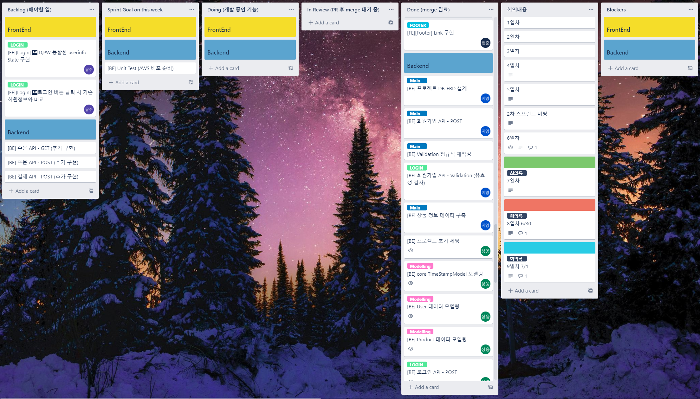
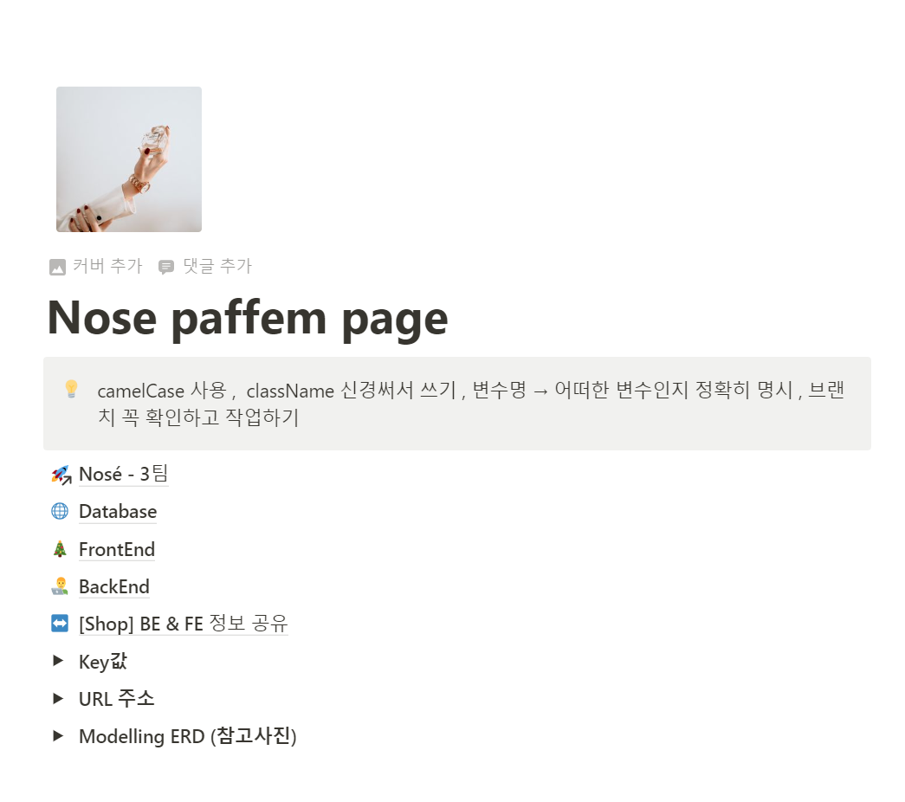

## ✅ 
---

   
  
   
  This is a main page.

https://user-images.githubusercontent.com/100059297/180118787-831127fe-23d9-4b56-8873-a4348dc99ebc.mov

📍 __Description__

This repository shows one of the clone coding projects as a backend developer as the first team project from Wecode coding Bootcamp 34th located in South Korea. 
[Wecode-bootcamp-Korea](https://github.com/wecode-bootcamp-korea)

Frontend Repository : (https://github.com/wecode-bootcamp-korea/34-1st-Nose-frontend)

 

📍 __Index__

1. Introduction  

2. Technology stack

3. Fuctions

 
 

## ✅ Introduction
---

This project aimed to apply things learned from the boot camp by implementing some features from the Paffem [PAFFEM](https://paffem.cafe24.com/) website which is available to recommend personal perfume function.

The images that this project is all from [pixabay](https://pixabay.com/ko/)which is regardless of copyright.

We used `Trello` and `Notion` for communiction.

   
  
   
  Trello

   
  
   
  Notion

 

### 📌 Purpose

1. Optimizing server by using `Django` of Python.

2. Implements Database by utilzing MySQL, and understanding ORM.

3. Building communication skills via various tools as backend developers.

4. Experiencing Scrum work.

 

### 📌 Team 'Nose'

2 members of Backend developers.

__김상웅 [sangwoong03](https://github.com/sangwoong03)__

- By using `dbdiagram` Data Modeling.

- `Django` Project initial setting.

- 'Login feature' and via `bcrpyt`, `pyjwt` implements Authorization API.

- 'Products list feature' and 'Products details' API .

 

__김지영 [KJY0627](https://github.com/KJY0627)__

- By using `dbdiagram` Data Modeling.

- Implements MySQL DataBase.

- 'Signup feature' and via `bcrypt`, save encoded personal information as Database.

- Carts API - POST, GET, DELETE.

 
 

## ✅ Technology stack
---

`requirements.txt` .

 

### 📌 Backend technology stack
| Language | Framwork |  Database |  ENV | HTTP  |
| :------: | :------: | :-------: | :--: | :--: |
|       |       | |  | 

 
 

## ✅ Fuctions
---
This project contains four features.

__1. Signup feature API__

- Member `validation check`

- Password `bcrypt` encode

 

__2. Login feature API__

- By using `bcrypt` encode/decode

- `jwt`token authorization/creat

 

__3. Products API__

- `Shop` - load products shopping list
- Products filtering via `Qeury Parameter'
- Loading detailed products information via `Path Parameter`

 

__4. Carts API__

- Add products from the product detail page
- Check authorized user's added products from the cart
- Delete authorized user's products from the cart
